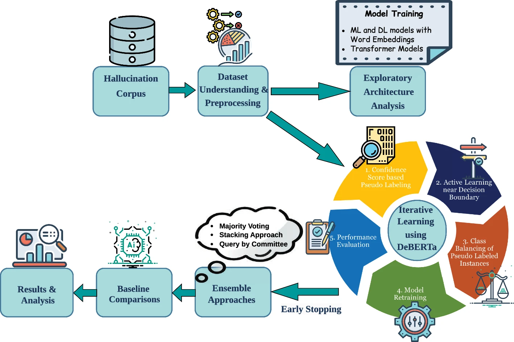

# Low-Resource Hallucination Detection in LLMs on Multi-Task Datasets via Iterative Pseudo-Labeling Using Confidence Thresholding and Active Learning

This repository contains the code and supporting materials for the research work:

**“Low-Resource Hallucination Detection in LLMs on Multi-Task Datasets via Iterative Pseudo-Labeling Using Confidence Thresholding and Active Learning.”**

The work is published in *Discover Artificial Intelligence* by Springer Nature.

**Published article:** [Springer Nature](https://link.springer.com/article/10.1007/s44163-026-02106-1)

---

## Overview

Large Language Models often generate outputs that are fluent but factually incorrect, commonly referred to as hallucinations. This research studies hallucination detection in low-resource settings, where only limited labeled data is available across multiple natural language generation tasks.

The work first explores different machine learning, deep learning, and transformer-based architectures before developing and evaluating a proposed iterative framework based on DeBERTa-v3 Large. The framework focuses on:
- Learning from limited labeled data
- Iterative self-training through confidence-based pseudo-labeling
- Active Learning for selecting informative samples
- Ensemble learning and Query-by-Committee for improved sample selection
- Evaluation using accuracy and Spearman correlation

The overall aim is to reduce the need for extensive manual annotation while improving hallucination detection under limited-resource conditions.

---

## Research Context

Hallucination detection is an important part of improving the reliability of Large Language Models, particularly as these models are increasingly used across different natural language generation tasks. However, developing reliable detection models can require substantial labeled data and manual annotation.

This work focuses on this challenge by studying an iterative semi-supervised approach that progressively expands the labeled training data using pseudo-labeling and selected manual annotations. The framework is evaluated on the publicly available SHROOM benchmark, which covers multiple natural language generation tasks and provides a low-resource setting for hallucination detection.

The study also examines the contribution of individual components of the framework and uses additional analysis to assess performance variability and annotation consistency.

---

## Data

This work uses the publicly available SHROOM dataset released as part of SemEval-2024 Task 6. Please obtain the dataset from the [official SHROOM repository](https://helsinki-nlp.github.io/shroom/2024) and follow its terms of use.

The dataset and its use in this study are described in the paper.
---

## Methodology

The proposed framework is an iterative semi-supervised approach for hallucination detection under low-resource conditions. DeBERTa-v3 Large is used as the backbone
model, based on its reported effectiveness for sequence classification and hallucination detection. The framework starts with a small manually labelled seed set and progressively expands the training data through successive iterations.

The methodology consists of the following stages:

1. **Initial model training:** A DeBERTa-v3 Large classifier is trained using the initial labelled dataset.

2. **Iterative self-training and pseudo-labeling:** The trained model predicts labels for the available unlabeled data. Confidence thresholds are used to select high-confidence predictions as pseudo-labels, with 100 samples from each class added during each iteration.

3. **Active Learning:** Samples near the decision boundary are selected for manual annotation to provide additional information where the model is less certain. The framework uses an uncertainty range of 0.40–0.60 for this stage.

4. **Ensemble learning:** Predictions from DeBERTa-v3 Large, RoBERTa Large MNLI, and ELECTRA Large Discriminator are combined using a Logistic Regression
   meta-classifier.

5. **Query-by-Committee:** The ensemble is used to identify samples on which the models disagree. A narrower uncertainty range of 0.45–0.55 is used to select informative samples for manual annotation.

These stages are applied iteratively to progressively expand the labelled training data while reducing the need for extensive manual annotation. 

### Methodology Framework

The overall workflow of the proposed framework is shown below.



**Figure 1.** Overview of the proposed iterative semi-supervised framework for low-resource hallucination detection.

---

## Evaluation

The framework is evaluated using two complementary metrics:
- **Accuracy** to measure binary hallucination classification performance
- **Spearman rank correlation** to measure the relationship between the model's predictions and the annotated hallucination scores

Bootstrap resampling is also used to estimate confidence intervals for the reported accuracy and Spearman correlation.

---

## Repository Structure

The notebooks cover the exploratory data analysis, model architecture evaluation, proposed framework, and additional analyses and experiments described in the paper.

```text
├── README.md
├── CITATION.cff
└── Code/
    ├── Additional_Analysis_and_Experiments.ipynb
    ├── Exploratory_Data_Analysis.ipynb
    ├── Model_Architecture_Exploratory_Analysis.ipynb
    └── Proposed_Framework_Model.ipynb
```

---

## Usage

The notebooks in the `Code` directory provide the analyses and experiments described in the paper:

- `Exploratory_Data_Analysis.ipynb` — exploratory analysis of the dataset.
- `Model_Architecture_Exploratory_Analysis.ipynb` — exploratory evaluation of different model architectures.
- `Proposed_Framework_Model.ipynb` — implementation and evaluation of the proposed iterative framework.
- `Additional_Analysis_and_Experiments.ipynb` — additional analyses and experiments reported in the paper.

To use the notebooks, download or clone the repository, install the required Python dependencies, and run the notebooks in a Jupyter environment or Google Colab.

The SHROOM dataset should be obtained separately from the official source described in the **Data** section. 

---

## Citation

If you use this work in your research, please cite:

Ramani, A., Venugopalan, M. Low-resource hallucination detection in LLMs on multi-task datasets via iterative pseudo-labeling using confidence thresholding and active learning. *Discover Artificial Intelligence* 6, 1011 (2026). https://doi.org/10.1007/s44163-026-02106-1

**Paper:** [Springer Nature](https://link.springer.com/article/10.1007/s44163-026-02106-1)

Copyright (c) 2026 Anirud Ramani and Manju Venugopalan, Amrita Vishwa Vidyapeetham.

```bibtex
@article{Ramani2026,
  author  = {Ramani, Anirud and Venugopalan, Manju},
  title   = {Low-resource hallucination detection in LLMs on multi-task datasets via iterative pseudo-labeling using confidence thresholding and active learning},
  journal = {Discover Artificial Intelligence},
  volume  = {6},
  pages   = {1011},
  year    = {2026},
  doi     = {10.1007/s44163-026-02106-1}
}
```

---

## Contact

For any questions, comments, or collaboration inquiries, please contact [Anirud R](anirud25@gmail.com).

---
